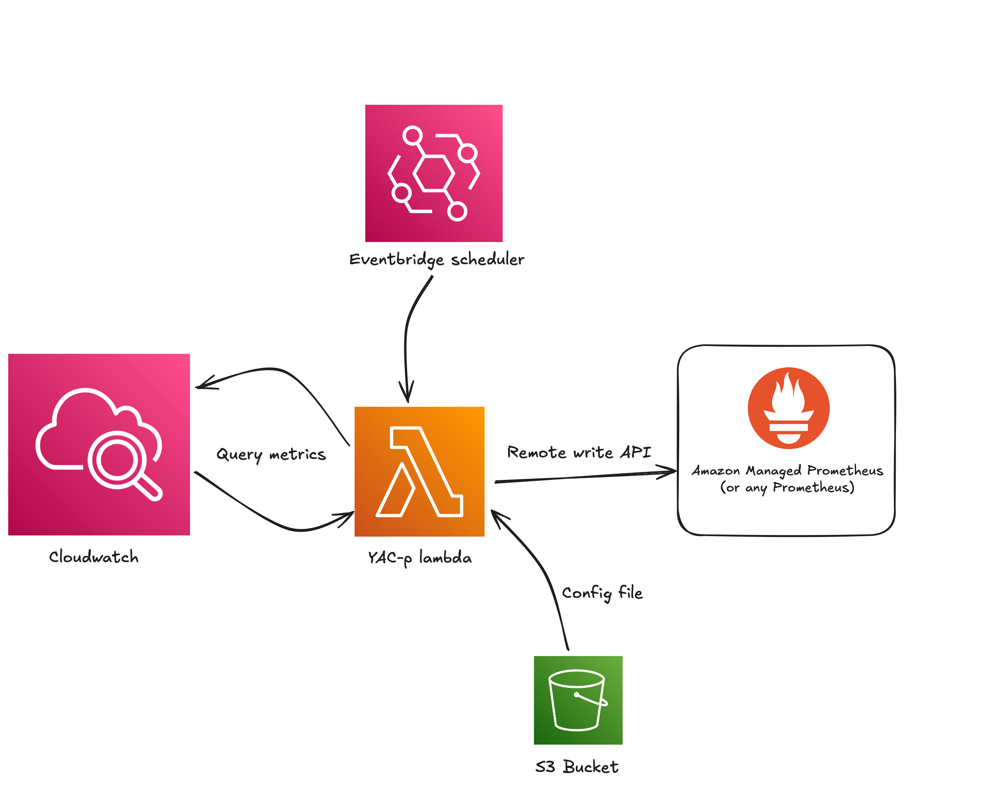
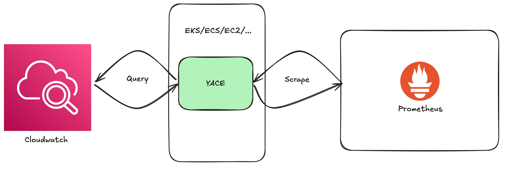
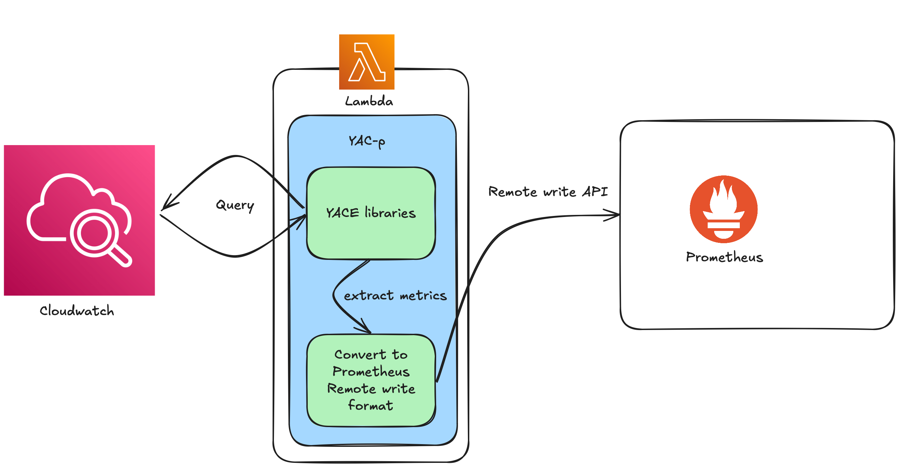

# YAC-p

YAC-p (Yet Another Cloudwatch Pusher) is heavily <b>(heavily)</b> based on YACE (Yet Another Cloudwatch Exporter)  
https://github.com/prometheus-community/yet-another-cloudwatch-exporter

<u>Note: This is a work in progress to say the least.</u>

YAC-p utilizes Go libraries from YACE to collect and convert Cloudwatch metrics into Prometheus remote write format and writes to your endpoint of choice.  
It runs as a Lambda function and only requires managed services to run (You don't have to host anything!).   

## Deployment

- Build the image and push to ECR
- Write a YACE job config file (https://github.com/prometheus-community/yet-another-cloudwatch-exporter/blob/master/docs/configuration.md)
- Deploy with included Terraform code

## Purpose

YAC-p fits in wherever you don't want to do metrics scraping to get access to your Cloudwatch metrics in Prometheus.   
There are multiple scenarios where push-based metrics collection might be more suitable than pull-based;

- <b>Decentralizing</b> - When in a multi-account cloud environment with centralized metric collection, keeping the configuration and responsibility of metrics collection in the scope of the client account simplifies scaling.

- <b>Network access</b> - Scraping through Firewalls or other network access control mechanism can be a hassle. Providing a single endpoint for push-based metrics delivery simplifies things.

- <b>Closer to real-time</b> - Instead of relying on the timing of an exporter and a scraping job, YAC-p delivers as fresh metrics as you want and Cloudwatch can manage to collect.  

## Features

- <b>Nothing to host</b> - Can run on fully managed AWS infrastructure, Eventbridge + Lambda + Amazon managed Prometheus (optional)
- <b>Yace compatible</b> - Uses YACE native job configurations and its amazing discovery features
- <b>Manage Prometheus the way you want (or not)</b> - Authentication options for Amazon Managed Prometheus, self-hosted Prometheus, etc

## Deployment

YAC-p can be deployed using fully managed services. Using Eventbridge to schedule the YAC-p Lambda function on a schedule it will deliver metrics to any Prometheus server, but when using Amazon Managed Prometheus it becomes a fully managed collection process.

## Deployment comparison

YACE is great, but it usually requires something to host it. That might be something that you are trying to avoid. It also introduces latency into the metric collection process, since it requires two unsynchronized collections of the metrics before it ends up at a usable destination.  

YAC-p fits better where you want to manage as litte infrastructure as possible. It can also reduce latency in the metrics collection process, since it queries Cloudwatch at you desired rate and delivers metrics instantly to Prometheus.

## Please try it!
Do it