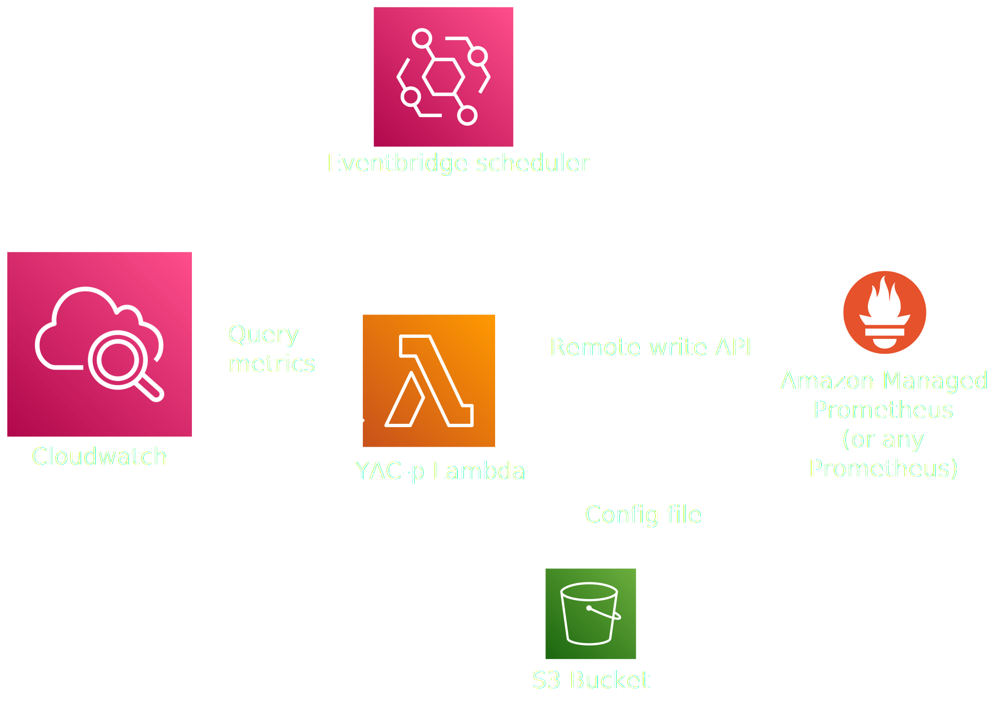

# YAC-p

YAC-p utilizes Go libraries from YACE to collect and convert Cloudwatch metrics into Prometheus format remote write format and writes to your endpoint of choice.  
It runs as a Lambda function and only requires AWS managed services to run (You don't have to host anything!).   

https://github.com/prometheus-community/yet-another-cloudwatch-exporter

## Purpose

YAC-p fits in wherever you don't want to do metrics scraping to get access to your Cloudwatch metrics in Prometheus.   
There are multiple scenarios where push-based metrics collection might be more suitable than pull-based;

- <b>Decentralizing</b> - When in a multi-account cloud environment with centralized metric collection, keeping the configuration and cost of metrics collection in the scope of the client account simplifies scaling and billing.

- <b>Network access</b> - Scraping through Firewalls or other network access control mechanism can be a hassle. Providing endpoints for push-based metrics delivery simplifies things.

## Features

- <b>Nothing to host</b> - Can run on fully managed AWS infrastructure, Eventbridge + Lambda + Amazon managed Prometheus (Works with your self-hosted Prometheus as well)
- <b>YACE compatible</b> - Uses YACE native configuration and its amazing discovery and metric enrichment features
- <b>Manage Prometheus the way you want (or not)</b> - Authentication options for Amazon Managed Prometheus, self-hosted Prometheus, etc
- <b>Full cross account functionality</b> - Collect metrics in one account and store in another. Or collect metrics cross account. Whatever floats your boat. 
- <b>Closer to real-time</b> - Instead of relying on the timing of an exporter and a scraping job, YAC-p delivers as fresh metrics as you want and Cloudwatch can manage to collect.

## Deployment

YAC-p can be deployed using fully managed services. Using Eventbridge to schedule the YAC-p Lambda function it will deliver AWS Cloudwatch metrics to any Prometheus server, but when using Amazon Managed Prometheus it becomes a fully AWS managed collection process.  
The included Terraform example code can deploy everything you need including a Amazon Managed Prometheus workspace.



## Try it out
- Write a YACE job config file: [configuration](https://github.com/prometheus-community/yet-another-cloudwatch-exporter/blob/master/docs/configuration.md), or try the included example for EC2
- Deploy with included Terraform code

## Lambda configuration
The included Terraform code will configure the Lambda for you, but if you want to deploy it in your own way there are a few environment variables to set;

```
PROMETHEUS_REMOTE_WRITE_URL - The URL of the Prometheus remote write endpoint
PROMETHEUS_REGION - If using AMP, the region needs to be configured
CONFIG_S3_BUCKET - The S3 bucket where the config file is stored
CONFIG_S3_PATH - The path of the config file
AUTH_TYPE - Authentication type to use for the remote write endpoint. Valid options are "AWS", "BASIC", "TOKEN. Leave empty if no authentication is required.
AWS_ROLE_ARN - Role to assume for writing metrics. Used only with Amazon Managed Prometheus when doing cross account remote writing.
DEBUG - Enables/disables debug logging. Accepts any value accepted by strconv.ParseBool (1, t, T, TRUE, true, True, 0, f, F, FALSE, false, False), empty equals to false.
```

## Advanced configuration
Concurrency settings normally passed to YACE via command line flags can be managed through environment variables. Settings are documented here: [Flags](https://github.com/prometheus-community/yet-another-cloudwatch-exporter/blob/master/docs/configuration.md#command-line-flags)

Each flag controlling concurrency has a corresponding environment variable, in screaming snake case with the prefix "YACE".  
Example: the flag "cloudwatch-concurrency" can be controlled through ```YACE_CLOUDWATCH_CONCURRENCY```.

## Customization
Go packages are available (https://pkg.go.dev/github.com/kjansson/yac-p) and can be used for custom applications.
The code included in ```cmd``` is for the Lambda implementation and config file storage in S3, but can easily be adapted using custom config file loaders.